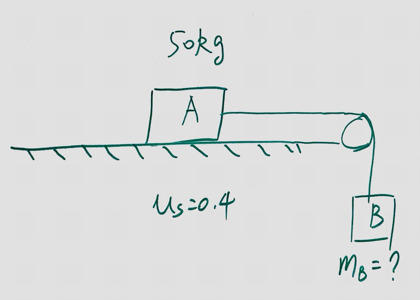
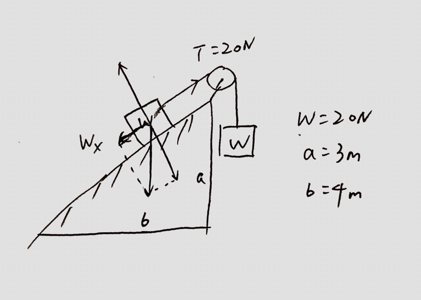

### 0503 Friction Forces
Kinetic and Static Friction

#### Exercises
(Mid Term 2) Block A, with a mass of 50kg, rests on a horizontal table top. The coefficient of static friction is 0.40. A horizontal string is attached to A and passed over a masseless, frictionless pulley as shown. The smallest mass $m_b$ of block B, attached to the danging end, that will start A moving when it is attached to the other end of the string is:

>Solution
$$
\begin{aligned}
m_b g &=\mu_k m_a g\\
\To m_b &= \mu_k m_a = 20kg
\end{aligned}
$$

(Mid Term 2) A 40-N crate rest on a rough horizontal floor. A 12-N horizontal force is ten applied to it. If the coefficient of the friction are $\mu_s = 0.5$ and $\mu_k = 0.4$, the magnitude of the friction force on the crate is:
>Solution
The maximum static friction force is $40 \times 0.5 = 20N$. When an external force of 12N is applied upone the crate, it does not move, the static firction force equals to that external 12N force.

(Mid Term 2) A block is placed on a rough wooden plane. It is found when the plane it tilted $30\degree$ to the horizontal, the block will slide down at constant speed. The coefficient of kinetic friction of the block with the plane is:
>Solution
$$
\begin{aligned}
F_s &= \mu_k mg\cos \th\\
mg\sin\th - F_s &= 0\\
\To \mu_k & = \frac{\sin\th}{\cos \th} = \tan 30 \degree
\end{aligned}
$$

(Mid Term 2) The system shown remains at rest. Each block weights 20N. The force of friction on the uppder block is:

>Solution
The block is at rest. By Newton's Second Law
$$
\begin{aligned}
\sum F &= T - mg\sin\th - F_s = 0\\
& = mg - mg\sin\th - F_s\\
\To F_s &= 8N
\end{aligned}
$$
