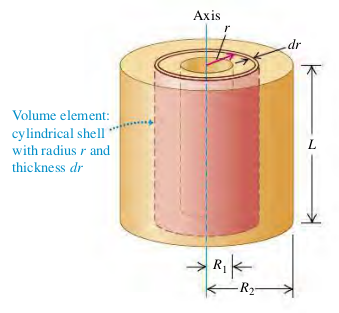

### 0906 Moment of Inertia
$$
\begin{aligned}
I = \int r^2 dm
\end{aligned}
$$

#### Examples
(9.10) Figure 9.23 shows a hollow cylinder of uniform mass density r with length L, inner radius $R_1$, and outer radius $R_2$. (It might be a steel cylinder in a printing press.) Using integration, find its moment of inertia about its axis of symmetry.

>Solution
$$
\begin{aligned}
I &= \int r^2 dm = \int_{R_1}^{R_2} r^2 \rho (2\pi r L dr)\\
&= 2\pi \rho L \int_{R_1}^{R_2} r^3 dr\\
&= \frac{2}{4} \pi \rho L(R_2^4 - R_1^4)\\
&= \frac{1}{2} \pi \rho L(R_2^2 - R_1^2)(R_2^2 + R_1^2) &\text{(1)}\\
\end{aligned}
$$
The cylinder's volume is $V = \pi L (R_2^2 - R_1^2)$, so its total mass is
$$
\begin{aligned}
M &= \rho V = \pi L (R_2^2 - R_1^2) &\text{(2)}
\end{aligned}
$$
Substituting Eq. (2) to Eq. (1), we see that
$$
\begin{aligned}
I &= \frac{1}{2} M(R_2^2 + R_1^2)
\end{aligned}
$$
If the cylinder is solid, with outer radius $R_2 = R$ and inner Radius $R_1 = 0$, its moment of inertia is
$$
\begin{aligned}
I &= \frac{1}{2}MR^2
\end{aligned}
$$
If the cylinder wall is very thin, we have $R_1 \approx R_2 = R$ and the moment of inertia is
$$
\begin{aligned}
I &= MR^2
\end{aligned}
$$

#### Exercises
(Quiz) Use Integration and $d I = r^2 dm$ to find the moment of inertia for a meter stick about 10cm point.
>Solution
$$
\begin{aligned}
I &= \int r^2 dm\\
&= \int_{-x}^{L-x} (r^2 \frac{M}{L})dr\\
&= \frac{1}{12}ML^2 + M(\frac{L}{2} - x)^2
\end{aligned}
$$
$L = 1m$, and $x = 0.1m$, so we see
$$
\begin{aligned}
I &= \frac{1}{12} M  + M(\frac{1}{2} - 0.1)^2\\
&= 0.243M
\end{aligned}
$$
