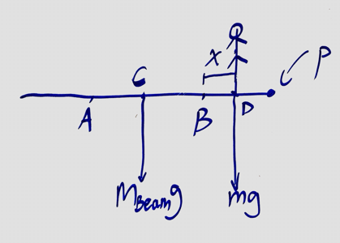
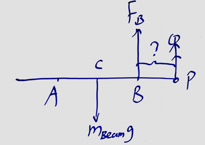

### Ch. 11 Equilibrium and Elasticity

#### Learning Objectives
1. Demonstrate mastery in calculating the net torque on an object, from an "extended" free-body diagram.
2. Demonstrate mastery of determining the appropriate "moment-of-inertia" of an object, given its mass and geometry.   (The "parallel-axis theorem" will be covered in the Quiz 9 learning goals.)
3. Demonstrate mastery of applying translational and rotational forms of Newton's laws to analyze fixed-axis rotation systems.
4. Demonstrate mastery of applying translational and rotational forms of Newton's laws to analyze moving-axis rotation systems.
5. Demonstrate mastery of applying translational and rotational forms of Newton's first laws to analyze static systems.

> HW: Ch.11.1-11.3
11, 12, 13, 14, 15, 18

(11.6) Two people are carrying a uniform wooden board that is 3.00 m long and weighs 160 N. If one person applies an upward force equal to 60 N at one end, at what point does the other person lift? Begin with a free-body diagram of the board.

>Solution
x = 2.4m

(11.8) A 50.0-cm, uniform, 50.0-N shelf is supported horizontally by two vertical wires attached to the sloping ceiling (the figure (Figure 1)). A very small 17.0-N tool is placed on the shelf midway between the points where the wires are attached to it.
a. Find the tension in left wire.
b. Find the tension in righ wire.

>Solution
a. $T_L = 16.8N$
b. $T_R = 50.2N$

(11.10) A uniform ladder 5.0 m long rests against a frictionless, vertical wall with its lower end 3.0 m from the wall. The ladder weighs 160 N. The coefficient of static friction between the foot of the ladder and the ground is 0.40. A man weighing 740 N climbs slowly up the ladder.
a. What is the maximum frictional force that the ground can exert on the ladder at its lower end?
b. What is the actual frictional force when the man has climbed 1.0 m along the ladder?
c. How far along the ladder can the man climb before the ladder starts to slip?

>Solution
a. $F_s = 360N$
b. $F_s = 171N$
c. $s = 2.7m$

(11.12) A uniform, aluminum beam 9.00 m long, weighting 300 N, rests symmetrically on two supports 5.00 m apart. A boy weighing 600 N starts at point A and walks toward the right.
a. How far beyond point B can the boy walk before the beam tips?
b. How far from the right end of the beam should support B be placed so that the boy can walk just to the end of the beam without causing it to tip?

>Solution
Let $C$ be the center of mass of the beam and $P$ be the pivot point. Just before the beam tips, the normal force at $A$ is zero and normal force at $B$ is the total weight of the beam and the boy.
a.  Let $BD = x$.
$$
\begin{aligned}
m_{beam}\cdot g \cdot CP + m_{boy}\cdot g &= F_B \cdot 2\\
300 \cdot \frac{9}{2} + 600 \cdot (2-x) &= (300 + 600) \cdot 2\\
\To & x=1.25m
\end{aligned}
$$
b. Let $BP = x$
$$
\begin{aligned}
m_{beam}\cdot g \cdot CP &= F_B \cdot BP\\
300 \cdot \frac{9}{2} & = (300 + 600) x\\
\To & x=1.5m
\end{aligned}
$$

(11.14) The horizontal beam in (Figure 1) weighs 190 N, and its center of gravity is at its center.

a. Find the tension in the cable.
b. Find the horizontal component of the force exerted on the beam at the wall.
c. Find the vertical component of the force exerted on the beam at the wall.
>Solution
a. $T = 658N$
b. $N_H = 527N$
c. $N_V = 95N$

(11.15) The boom in the figure below (Figure 1) weighs 2150 N and is attached to a frictionless pivot at its lower end. It is not uniform; the distance of its center of gravity from the pivot is 35 % of its length.

a. Find the tension in the guy wire.
b. Find the horizontal component of the force exerted on the boom at its lower end.
c. Find the vertical component of the force exerted on the boom at its lower end.
>Solution
a. $T = 3320N$
b. $F_H = 3320N$
c. $F_V = 7150N$

(11.19) A 3.00-m-long, 160-N, uniform rod at the zoo is held in a horizontal position by two ropes at its ends in (Figure 1). The left rope makes an angle of $150 \degree$ with the rod and the right rope makes an angle θ with the horizontal. A 90-N howler monkey (Alouatta seniculus) hangs motionless 0.50 m from the right end of the rod as he carefully studies you.

a. Calculate the tension in the left rope.
b. Calculate the tension in the right rope.
c. Calculate the angle $\th$.
>Solution
a. $T_l = 190N$
b. $T_r = 230N$
c. $\th = 43\degree$
