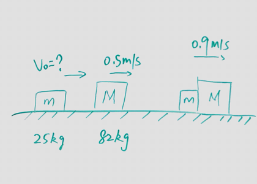

### Inelastic Collision
+ **Inelastic**
Bodies collide, bounce off, eath other move off with seperate velocities.
_Ex_: car collison and unstuck
+ **Perfectly Inelastic**
Bodies collide and stick together, and have the same final velocity.
*Ex*: asteroid hitting earch, bug hitting car windshield

In both case, only **momentum** is conserved, the **kinetic energy** is not conserved.

$$
\begin{aligned}
\vec P_i &= \vec P_f\\
m_1v_{1i} + m_2v_{2i} &= m_1v_{1f} + m_2v_{2f}\\
KE_1 &= \frac{1}{2}(m_1v_{1i}^2+m_2v_{2i}^2)\\
KE_2 &= \frac{1}{2}(m_1v_{1f}^2+m_2v_{2f}^2)\\
\Delta KE &= KE_2 - KE_1 \ne 0
\end{aligned}
$$

#### Exercises
(8.21) On a frictionless, horizontal air table, puck A (with mass 0.250 kg) is moving toward puck B (with mass 0.355 kg), that is initially at rest. After the collision, puck A has a velocity of 0.119 m/s to the left, and puck B has velocity 0.650 m/s to the right.
(a) What was the speed of puck A before the collision?

>Solution
**Identify**: Apply _conservation of momentum_ to the system of the two pucks.
**Set up**: Let $+x$ be to the right.
**Execute**:
$$
\begin{aligned}
P_i &= P_f\\
m_a v_{ai} &= m_a v_{af} + m_b v_{bf}\\
m_a &= 0.25kg, v_{af} = -0.119 m/s, m_b = 0.355kg, v_{bf} = 0.650 m/s\\
v_{ai} &= \frac{m_a v_{af} + m_b v_{bf}}{m_a}\\
&= \frac{-0.119 \times 0.25 + 0.355\times 0.650}{0.25}\\
&= 0.804m/s
\end{aligned}
$$

(b) Calculate the change in the total kinetic energy of the system that occurs during the collision.
>Solution
$$
\begin{aligned}
K_1 &= \frac{1}{2}(m_a v_{ai}^2 + m_b v_{bi}^2)\\
&= \frac{1}{2}(0.250 \times 0.804^2 + 0)\\
&= 8.08 \times 10^{-2} J\\
K_2 &= \frac{1}{2}(m_a v_{af}^2 + m_b v_{bf}^2)\\
&= \frac{1}{2}(0.250 \times (-0.119)^2 + 0.355 \times 0.650^2)\\
&= 7.68 \times 10^{-2} J\\
\Delta K &= K_2 - K_1 = -4.04 \times 10^{-3} J
\end{aligned}
$$

(Quiz) A block of mass $m = 25kg$ has a speed of $v$ and is behind of a block $M=82kg$ that has a speed of $0.5m/s$. THe surface is frictionless. The blocks collide and couple. After the collision, the blocks have a commone speed of $0.9m/s$. Find the loss of kinetic energy.

>Solution
1\. By Conservation of Momentum
$$
\begin{aligned}
mv + Mv_{M0} &= (m+M)v_f\\
v &= \frac{(m+M)v_f - Mv_{M0}}{m} \\
&= \frac{0.9 \cdot (25 + 82)) - 0.5 \cdot 82}{25} \approx 2.2m/s
\end{aligned}
$$
2\. By Conservation of Energy
$$
\begin{aligned}
\frac{1}{2}mv^2 + \frac{1}{2}Mv_{M0}^2 &= \frac{1}{2}(m+M)v_f^2 + E_{loss}\\
E_{loss} &= \frac{1}{2}mv^2 + \frac{1}{2}Mv_{M0}^2 - \frac{1}{2}(m+M)v_f^2\\
&= \frac{1}{2} \times 25 \times 2.2^2 +  \frac{1}{2} \times 82 \times 0.5^2 -  \frac{1}{2} \times (25+82) \times 0.9^2\\
&= 27.42 J
\end{aligned}
$$

(Mid Term 2) A block moves at 5.0m/s in the positive x direction and hits an identical block, initial at rest. A small amount of gunpowder had been placed on one of the blockes, The explosion does not harm the blocks but it doubles their total kinectic energy. After the explosion the blocks move along the x axis the incident block has a speed of:
>Solution
$$
\begin{aligned}
m_1 v_0 &= m_1 v_1 + m_2 v_2\\
\frac{1}{2} m_1 v_1^2 + \frac{1}{2} m_2 v_2^2 &= 2 \times (\frac{1}{2}m_1 v_0^2)\\
m_1 &= m_2\\
\To 2v_2^2 &-10v_2-25 = 0\\
\To v_2 &= 6.83m/s \text{ or } -1.83m/s
\end{aligned}
$$
The second block moves along positve axis at $v_2 = 6.83m/s$; the first block moves along negative x-axis at $v_1 = 1.83m/s$
