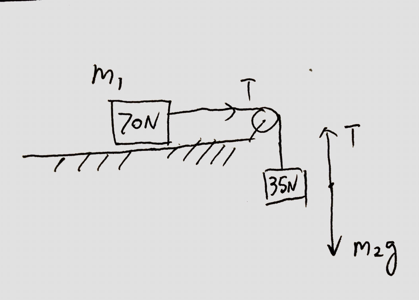

(Mid Term 1) A 70-N blocka and a 35-N block are connected by a string as shown. If the pulley is massless and the surface is frictionless. Find the magnitude of the acceleration of the 35-N block.

>Solution
By Newton's Second Law, we have
$$
\begin{aligned}
m_1 a  &= T\\
m_2 g - T &= m_2 a\\
\To a &= \frac{m_2}{m_1 + m_2} \cdot g\\
&= \frac{35}{35+70} \cdot 9.8 \approx 3.3m/s^2
\end{aligned}
$$
