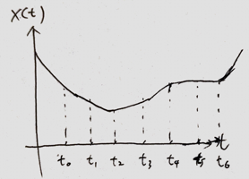
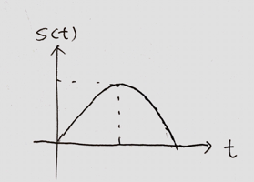
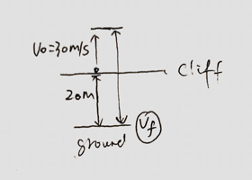

1\. Describe the motion at interval $[t_0, t_6]$.

>Solution
$[t_0, t_2]$, Moving backward at a constant acceleration.
$[t_2, t_4]$, Moving forward at a constant acceleration.
$[t_4, t_6]$, At rest.
$[t_6, )$, Moving forward at a constant accleration.

2\. Grasshopper jumps upward, and reaches a max height of $1m$. Find the total time it is in the air. (up and down).

>Solution
When the grasshopper reaches the max height, $v_f = 0m/s$.
$$
\begin{aligned}
v_f^2 &= v_0^2 + 2ay & a=9.8m/s^2, y=1m\\
0 &=  v_0^2 + 2\cdot9.8\cdot 1 \To v_0 = \sqrt {19.6} m/s
\end{aligned}
$$
When the grasshopper finally hits the ground, $y_f = 0m$
$$
\begin{aligned}
y_f &= v_0 t + \frac{1}{2}at^2 \\
0 &= \sqrt {19.6} t + \frac{1}{2} \cdot 9.8 \cdot t^2\\
\To t &\approx 0.89s
\end{aligned}
$$

3\. An object is thrown upward on a cliff $20m$ from the ground at an intial velocity of $30m/s$. Find the final velocity before it hits the ground.

>Solution
According the kinematic equation, $v_f^2 = v_0^2 + 2ay$. We have $v_0=-30m/s, a=9.8m/s^2, y=20m$ (moving downward being positive direction).
$$
\begin{aligned}
v_f^2 &= (-30)^2 + 2\cdot 9.8 \cdot 20\\
\To &v_f = \sqrt {1292} m/s \approx 35.94m/s
\end{aligned}
$$
