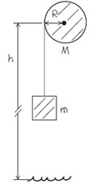

### 1002 Torque and Angular Acceleration
Rotational analog of Newton's second law for a rigid body
$$
\begin{aligned}
\sum \tau = I \alpha
\end{aligned}
$$

#### Exercises
(10.9) The flywheel of an engine has moment of inertia $1.30 kg \cdot m^2$ about its rotation axis. What constant torque is required to bring it up to an angular speed of 400 rev/min in 8.00 s, starting from rest?
>Solution
$$
\begin{aligned}
\omega &= 400rev/min = \frac{400 \cdot 2\pi}{60} rad/s\\
\alpha & = \frac{\omega}{\Delta t} = 5.24rad/s\\
\tau & =I \alpha\\
&= 1.30 \cdot 5.24 = 6.81 N \cdot m
\end{aligned}
$$

(10.10) A cord is wrapped around the rim of a solid uniform wheel 0.250 m in radius and of mass 9.20 kg. A steady horizontal pull of 38.0 N to the right is exerted on the cord, pulling it off tangentially from the wheel. The wheel is mounted on frictionless bearings on a horizontal axle through its center.
a. Compute the angular acceleration of the wheel.
b. Compute the acceleration of the part of the cord that has already been pulled off the wheel.
c. Find the magnitude of the force that the axle exerts on the wheel.
d. Find the direction of the force that the axle exerts on the wheel.
>Solution
Todo
c. $97.8N$
d. $67.1\degree$
a. Let the pivot point be the center of the whell, the only torque about its axis is the horizontal pulling force $T$.
$$
\begin{aligned}
\sum \tau &= T R = I \alpha = \frac{1}{2} mR^2 \alpha\\
\To \alpha &=  \frac{2T}{mR}\\
&= \frac{2\cdot 38}{9.2 \cdot 0.25} = 33.0 rad/s
\end{aligned}
$$
b. $a = \alpha \cdot R = 33.0 \cdot 0.25 = 8.26m/s^2$
c.

(10.12) A stone is suspended from the free end of a wire that is wrapped around the outer rim of a pulley, similar to what is shown in (Figure 1). The pulley is a uniform disk with mass 13.0 kg and radius 27.0 cm and turns on frictionless bearings. You measure that the stone travels a distance 12.1 m during a time interval of 3.50 s starting from rest.

a. Find the mass of the stone.
b. Find the tension in the wire.
>Solution
1\. For the stone, Kinematic Equation gives
$$
\begin{aligned}
y &= v_0 t + \frac{1}{2}a t^2\\
\To a &= \frac{2y}{t^2}\\
&= \frac{2 \cdot 12.1}{3.5^2} = 1.98m/s^2
\end{aligned}
$$
2\. For the cylinder, the only torque about its axis (let the center of the disk be the pivot point) is that due to the wire tension. Hence
$$
\begin{aligned}
\sum \tau = T\cdot R = I\alpha = \frac{1}{2}MR^2 \alpha
\end{aligned}
$$
The acceleration of the stone is the same as the tangential acceleration of a point on the cylinder rim, so we have
$$
\begin{aligned}
a &= \alpha R \To \alpha = \frac{a}{R}\\
T\cdot R & = \frac{1}{2}MR^2 \cdot \frac{a}{R}\\
T &= \frac{1}{2} M a\\
&= \frac{13 \cdot 1.98}{2} = 12.8N
\end{aligned}
$$
3\. For the stone, Newton's second gives
$$
\begin{aligned}
\sum F_y &= mg + (-T) = ma\\
\To m &= \frac{T}{g-a}\\
&= \frac{12.8}{9.8 - 1.98} =  1.64kg
\end{aligned}
$$

(10.15) A wheel rotates without friction about a stationary horizontal axis at the center of the wheel. A constant tangential force equal to 72.0 N is applied to the rim of the wheel. The wheel has radius 0.150 m. Starting from rest, the wheel has an angular speed of 13.3 rev/s after 2.11 s.
a. What is the moment of inertia of the wheel?
>Solution
a. $I = 0.273kg\cdot m^2$
