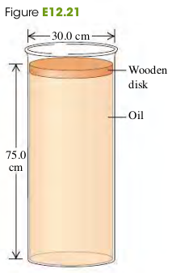

### 1202 Pressure In a Fluid
We define the **pressure** $p$ at that point as the normal force per unit area - that is, the ratio of $dF_{\perp}$ to $dA$:
$$
\begin{aligned}
p = \frac{dF_{\perp}}{dA}
\end{aligned}
$$
where $p$ is the pressure at a point in a fluid, $dF_{\perp}$ is the normal force exerted by the fluid on a small surface at that point, and $dA$ is the area of the surface.

+ Atmospheric pressure $p_a = 1 \text{atm} = 1.013 \times 10^5 Pa$

#### Exercises
9, 10, 15, 21, 18, 21, 24

(12.9) Oceans on Mars. Scientists have found evidence that Mars may once have had an ocean 0.500 km deep. The acceleration due to gravity on Mars is $3.71 m/s^2$.
a. What would be the gauge pressure at the bottom of such an ocean, assuming it was freshwater?
b. To what depth would you need to go in the earth's ocean to experience the same gauge pressure?
>Solution
a. $1.86 \times 10^6 Pa$
b. 184m

(12.10) (a) Calculate the difference in blood pressure between the feet and top of the head for a person who is 1.60 m tall. (b) Consider a cylindrical segment of a blood vessel 2.80 cm long and 2.20 mm in diameter. What additional outward force would such a vessel need to withstand in the person's feet compared to a similar vessel in her head?
>Solution
a. Pressure difference
$$
\begin{aligned}
p &= \rho g h\\
&= 1060 \cdot 9.8 \cdot 1.6 = 1.66 \times 10^4 Pa
\end{aligned}
$$
b. Additional Force
$$
\begin{aligned}
F = pA &= p (\pi d \cdot h)\\
&= 1.66 \times 10^4 \cdot \pi \cdot 0.0022 \cdot 0.028
&= 3.22 N
\end{aligned}
$$

(12.15) **Ear Damage from Diving**. If the force on the tympanic membrane (eardrum) increases by about 1.5 N above the force from atmospheric pressure, the membrane can be damaged. When you go scuba diving in the ocean, below what depth could damage to your eardrum start to occur? The eardrum is typically 8.2 mm in diameter. (Consult Table 12.1.)
>Solution
The pressure from the additional 1.5 N force on the surface of eardrum is
$$
\begin{aligned}
P &= \frac{F}{\pi r^2}\\
&= \frac{1.5}{\pi \cdot 0.0041^2} Pa\\
\end{aligned}
$$
The same pressure made by the ocean can be expressed as follows
$$
\begin{aligned}
P &= \rho g h \\
\To h &= \frac{P}{\rho g}\\
&= \frac{1.5}{\pi \cdot 0.0041^2} \cdot \frac{1}{1030 \cdot 9.8} = 2.8m
\end{aligned}
$$

(12.18) The lower end of a long plastic straw is immersed below the surface of the water in a plastic cup. An average person sucking on the upper end of the straw can pull water into the straw to a vertical height of 1.1 m above the surface of the water in the cup.
>Solution
a.
$$
\begin{aligned}
p_g &= -\rho g h\\
&= -1000 \cdot 9.8 \cdot 1.1 = -10780Pa
\end{aligned}
$$
b. In order for water to go up the straw, the pressure at the top of the straw must be less than the atmospheric pressure.

(12.21) A cylindrical disk of Figure e12.21 wood weighing 45.0 N and having a diameter of 30.0 cm floats on a cylinder of oil of density $0.850 g/cm^3$ (Fig. E12.21). The disk cylinder of oil is 75.0 cm deep and has a diameter the same as that of the wood.
(a) What is the gauge pressure at the top of the oil column?
(b) Suppose now that someone puts a weight of 83.0 N on top of the wood, but no oil seeps around the edge of the wood. What is the change in pressure at (i) the bottom of the oil and (ii) halfway down in the oil?

>Solution
a. $P = \frac{F}{\pi r^2} = \frac{45}{\pi \cdot 0.15^2} = 636Pa$
b. Both the change of pressure come from the additional weight and are the same.
$$
\begin{aligned}
P_{diff} &= \frac{w_{add}}{\pi r^2}\\
&= \frac{83}{\pi \cdot 0.15^2} = 1174Pa
\end{aligned}
$$

(12.24) The piston of a hydraulic automobile lift is 0.30 m in diameter.
a. What gauge pressure, in pascals, is required to lift a car with a mass of 1200 kg?
b. Express the result of part A in atmospheres.
>Solution
$$
\begin{aligned}
P &= \frac{F}{A}\\
&= \frac{1200 \cdot 9.8}{\pi\cdot 0.15^2} = 1.7 \times 10^5Pa\\
&= \frac{1.7 \times 10^5}{1.01 \times 10^5} = 1.6 atm
\end{aligned}
$$
