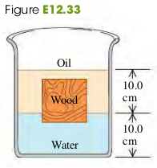

### 1203 Buoyancy

**Archimedes's principLe**: When a body is completely or partially immersed in a fluid, the fluid exerts an upward force on the body equal to the weight of the fluid displaced by the body.

#### Exercises
26, 28, 30, 31, 32, 33

(12.26) A rock has mass 1.80 kg. When the rock is suspended from the lower end of a string and totally immersed in water, the tension in the string is 12.8 N. What is the smallest density of a liquid in which the rock will float?
>Solution
Todo

(12.28) A slab of ice floats on a freshwater lake. What minimum volume must the slab have for a 65.0-kg woman to be able to stand on it without getting her feet wet?
>Solution
$$
\begin{aligned}
m_{ice} g+ m_{w}g & = \rho_{water} v_{sub} g\\
\rho_{ice} v_{ice} g+ m_{w}g & = \rho_{water} v_{sub} g\\
v_{ice} &= v_{sub}\\
\To v_{ice} &= \frac{m_{w}}{\rho_{water} - \rho_{ice}}\\
&= \frac{65}{1000-920} = 0.8m^3
\end{aligned}
$$

(12.30) You are preparing some apparatus for a visit to a newly discovered planet Caasi having oceans of glycerine and a surface acceleration due to gravity of $5.40 m/s^2$. If your apparatus floats in the oceans on earth with 34.0 % of its volume submerged, what percentage will be submerged in the glycerine oceans of Caasi?
>Solution
On Earth
$$
\begin{aligned}
\rho_{object} V_{object} g &= \rho_{ocean} V_{sub} g\\
\To \rho_{object} &= \frac{V_{sub}}{V_{object}} \cdot \rho_{ocean}\\
& = 0.34 \cdot 1030 kg/m^3
\end{aligned}
$$
On Mars
$$
\begin{aligned}
\rho_{object} V_{object} g &= \rho_{glycerine} V_{sub} g\\
\frac{V_{sub}}{V_{object}} &= \frac{\rho_{object}}{\rho_{glycerine}}\\
&= \frac{0.34 \cdot 1030}{1260} = 27.8\%
\end{aligned}
$$

(12.31) A rock with density $2300 kg/m^3$ is suspended from the lower end of a light string. When the rock is in air, the tension in the string is 43.0 N . What is the tension in the string when the rock is totally immersed in a liquid with density $750 kg/m^3$?
>Solution
1\. The volume $V$ of the rock
$$
\begin{aligned}
V &= \frac{W}{g \rho}\\
&=\frac{43}{9.8 \cdot 2300} = 0.0019m^3
\end{aligned}
$$
2\. Newtons's First Law
$$
\begin{aligned}
W &= F_B + T = \rho_{liquid} g V + T\\
\To T &= W - \rho_{liquid} g V\\
&= 43 - 750 \cdot 9.8 \cdot 0.0019 = 29 N
\end{aligned}
$$

(12.32) A hollow, plastic sphere is held below the surface of a freshwater lake by a cord anchored to the bottom of the lake. The sphere has a volume of $0.670 m^3$ and the tension in the cord is 1120 N.
a. Calculate the buoyant force exerted by the water on the sphere.
b. What is the mass of the sphere?
c. The cord breaks and the sphere rises to the surface. When the sphere comes to rest, what fraction of its volume will be submerged?
>Solution
a. $F = 6570N$
b. $m=556kg$
c. $\frac{V_{sub}}{V_{obj}} = 82.9 \%$

(12.33) A cubical block of wood, 10.0 cm on a side, floats at the interface between oil and water with its lower surface 1.50 cm below the interface (Fig. E12.33). The density of the oil is $790 kg/m^3$. (a) What is the gauge pressure at the upper face of the block? (b) What is the gauge pressure at the lower face of the block? (c) What are the mass and density of the block?

>Solution
The pressure on the upper face comes from the oil with height of $0.015$ m, and the pressure on the lower face comes from the total of the oil with height of $0.1$m and the water wight height of $0.015$ m.
$$
\begin{aligned}
P_{upper} &= \rho_{o} g h_1\\
&= 790 \cdot 9.8 \cdot 0.015 = 116 Pa\\
P_{lower} &= \rho_{o} g \cdot 0.1  + \rho_{w} g h_1\\
&= 790 \cdot 9.8 \cdot 0.1 + 1000 \cdot 9.8 \cdot 0.015 = 921.2 Pa\\
\end{aligned}
$$
The weight of the block is the product of the pressure difference and the area of one side of the block.
$$
\begin{aligned}
w &= (P_{lower} - P_{}) \cdot A\\
&= (921.2-116) \cdot 0.1^2 = 8.05N\\
\rho_w &= \frac{w}{g V}\\
&= \frac{8.05}{9.8 \cdot 0.1^3} = 821.5kg/m^3
\end{aligned}
$$
