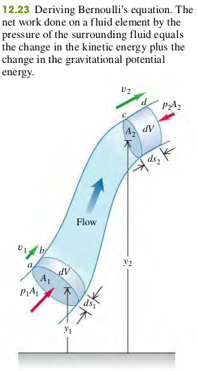
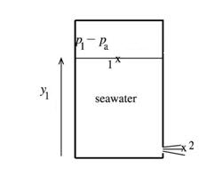

### 1205 Bernoulli's Equation

Bernoulli's equation for an ideal incompressible fluid
$$
\begin{aligned}
p_1 + \rho g y_1 + \frac{1}{2}\rho v_1^2 &= p_2 + \rho g y_2 + \frac{1}{2}\rho v_2^2 &\text{(1)}\\
p + \rho g y + \frac{1}{2}\rho v^2 &= \textrm{constant} &\text{(2)}\\
\end{aligned}
$$
$p$ - Pressure.
$g$ - Acceleration due to gravity.
$y$ - Elevation.
$v$ - Fluid speed.
$\textrm{consant}$ - Value is the same at all points in flow tube.

#### Exercises
41, 42, 44, 46

(12.41) A sealed tank containing seawater to a height of 10.1 m also contains air above the water at a gauge pressure of 3.15 atm . Water flows out from the bottom through a small hole.
>Solution
Apply Bernoulli's equation with points 1 and 2 chosen as shown in the figure. Let $y=0$ at the bottom of the tank so $y_1=10.1m$ and $y_2=0$. The target variable is v2.
$p_1 - p_a=3.15atm$.

$$
\begin{aligned}
p_1 + \rho gy_1 + \frac{1}{2} \rho v_1^2 = p_2 + \rho gy_2 + \frac{1}{2} \rho v_2^2
\end{aligned}
$$
$A_1 v_1 = A_2 v_2$, so $v_1 = (A_2 / A_1) v_2$. But the cross-sectional area of the tank $A_1$ is much larger thant the cross_sectional area of the hole $A_2$, so $v_1 << v_2$, and the term $\frac{1}{2} \rho v_1^2$ can be neglected. Then we have
$$
\begin{aligned}
\frac{1}{2} \rho v_2^2 &= (p_1 - p_2) + \rho gy_1\\
p_2 &= p_a\\
\To v_2 &= \sqrt{\frac{2{(p_1 - p_2)}}{\rho} + 2gy_1}\\
&= \sqrt{\frac{2{(3.15 \cdot 1.013 \cdot 10^5 - 1.013 \cdot 10^5)}}{1030} + 2 \cdot 9.8 \cdot 10.1}\\
&= 28.6m/s
\end{aligned}
$$
If the pressure at the top surface of the water were air pressure, then Toricell's theorem gives $v_2 = \sqrt{2g(y_1-y_2)} = 14.1m/s$. The actual afflux speed is much larger than this due to the excess pressure at the top of the tank.

(12.42) **Artery blockage**. A medical technician is trying to determine what percentage of a patient's artery is blocked by plaque. To do this,she measures the blood pressure just before the region of blockage and finds that it is $1.20 \times 10^4Pa$ , while in the region of blockage it is $1.15 \times 10^4Pa$. Furthermore, she knows that the blood flowing through the normal artery just before the point of blockage is traveling at $30.0 cm/s$, and that the specific gravity of this patient's blood is $1.06$. What percentage of cross-sectional area of the patient's artery is blocked by the plaque?
>Solution
First, we use Bernoulli's Eqaution while assuming that $y_1 = y_2$, where '1' and '2' correspond to regions before and after the blockage, respectively. We first determine the speed of the blood in the blockage with
$$
\begin{aligned}
p_1 + \rho gy_1 + \frac{1}{2} \rho v_1^2 &= p_2 + \rho gy_2 + \frac{1}{2} \rho v_2^2\\
v_2 &= \sqrt{\frac{2(p_1-p_2)}{\rho} + \rho g (y_1-y_2) + v_1^2}\\
&= \sqrt{\frac{2(1.20 \times 10^4-1.15 \times 10^4)}{1060} + 0 + (0.3)^2}\\
&= 1m/s
\end{aligned}
$$
We then use the Continuity Equation to find
$$
\begin{aligned}
A_1 v_1 &= A_2 v_2\\
\To \frac{A_2}{A_1} &= \frac{v_1}{v_2} = \frac{0.3}{1} = 0.30
\end{aligned}
$$
Therefore the artery is 70% blocked by the plaque.

(12.44) A small circular hole 6.00 mm in diameter is cut in the side of a large water tank, 14.0 m below the water level in the tank. The top of the tank is open to the air.
a. What is the speed of efflux?
b. What is the volume discharged per unit time.
>Solution
a. $v = \sqrt {2hg} = \sqrt {2 \cdot 9.8 \cdot 14} = 16.6m/s$. (Toricell's theorem)
b. $\frac{dV}{dt} = A \frac{dS}{dt} = Av = \pi (3 \cdot 10^{-3})^2 \cdot 16.6 = 4.69 * 10^{-4} m^3/s$

(12.46) At one point in a pipeline the water's speed is $3.00m/s$ and the gauge pressure is $5.00 \times 10^4Pa$. Find the gauge pressure at a second point in the line, 11.0m lower than the first, if the pipe diameter at the second point is twice that at the first.
>Solution
$$
\begin{aligned}
p_1 + \rho gy_1 + \frac{1}{2} \rho v_1^2 &= p_2 + \rho gy_2 + \frac{1}{2} \rho v_2^2\\
p_2 &= p_1+ \rho g(y_1-y_2) + \frac{1}{2} \rho ( v_1^2 -  v_2^2)\\
p_1 &= 5\cdot 10^4\\
y_1 & = 11\\
y_2 &= 0\\
A_1 v_1 &= A_2 v_2\\
A_2 &= 4 A_1\\
\To p_2 &= 1.6 \cdot 10^5 Pa
\end{aligned}
$$
