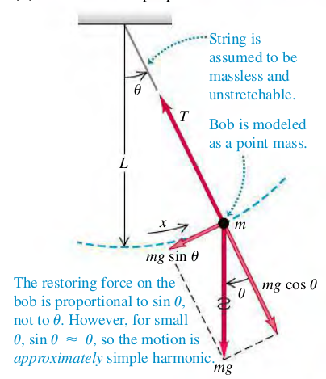

### 1405 The Simple Pendulum
A **simple pendulum** is an idealized model consisting of a point mass suspended by a massless, unstretchable string.

The restorng force is the tangential component of the net force:
$$
\begin{aligned}
F_{\th} = -mg\sin \th
\end{aligned}
$$
Since $F_{\th}$ is proportional to $\sin \th$, not $\th$, the motion is _not_ SHM. Howeverm if angle $\th$ is small, $\sin \th$ is very nearly equal to $\th$ in radians. With tis approximation, we have
$$
\begin{aligned}
F_{\th} = -mg \th = -mg \frac{x}{L} = -\frac{mg}{L} x
\end{aligned}
$$
The restoring force is then proportional to the coordinate for small displacements, and the force constant $k = mg/L$. The angular frequency $\omega$ of a simple pendulum with small amplitude is
$$
\begin{aligned}
\omega = \sqrt {\frac{k}{m}} = \sqrt {\frac{mg/L}{m}} = \sqrt {\frac{g}{L}}
\end{aligned}
$$
The coresponding period is
$$
\begin{aligned}
T = \frac{2\pi}{\omega} = 2\pi \sqrt{\frac{L}{g}}
\end{aligned}
$$

#### Exercises
(14.45) You pull a simple pendulum 0.240 m long to the side through an angle of $3.5 \degree$ and release it.
(a) How much time does it take the pendulum bob to reach its highest speed?
(b) How much time does it take if the pendulum is released at an angle of $1.75 \degree$ instead of $3.5 \degree$?
>Solution
a. $\th = 3.5 \cdot \frac{\pi}{180}$

(14.47) A building in San Francisco has light fixtures consisting of small 2.35-kg bulbs with shades hanging from the ceiling at the end of light, thin cords 1.50 m long. If a minor earthquake occurs, how many swings per second will these fixtures make?
>Solution
$$
\begin{aligned}
f = \frac{\omega}{2\pi} &= \frac{1}{2\pi} \cdot \sqrt{\frac{g}{L}}\\
&= \frac{1}{2\pi} \cdot \sqrt{\frac{9.8}{1.5}} = 0.407 s^{-1}
\end{aligned}
$$

(14.48) **A Pendulum on Mars**. A certain simple pendulum has a period on the earth of $1.60 s$. What is its period on the surface of Mars, where $g = 3.71 m/s^2$?
>Solution
On Earth
$$
\begin{aligned}
T &= 2\pi \sqrt {\frac{L}{g}}\\
\To L &= g\cdot (\frac{T}{2\pi})^2 = 9.8 \cdot (\frac{1.6}{2\pi})^2 = 0.635m\\
\end{aligned}
$$
On Mars
$$
\begin{aligned}
T_{Mars} &= 2\pi \sqrt {\frac{L}{g_{Mars}}}\\
&= 2\pi \sqrt {\frac{0.635}{3.71}} = 2.60s
\end{aligned}
$$
