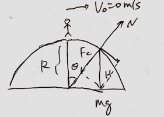

A skier is skiing along a _frictionless_ circular track with radius of $R=10m$. Find the height where she leaves the surface of hemisphere.

>Solution
**First**, let's find final velocity $v_f$ before she leaves the surface, at the moment she leave the surface, the normal force is zero. $N=0$
$$
\begin{aligned}
\sum F_c &= W\cos \th - N\\
\frac{mv_f^2}{R} &= mg\cos \th - 0\\
v_f & = \sqrt{gR\cos \th}
\end{aligned}
$$
**Second**, accoriding to conservation of energy,
$$
\begin{aligned}
\frac{1}{2}mv_0^2 + mgR &= \frac{1}{2}mv_f^2 + mgH\\
0 + mgR &= \frac{1}{2}(\sqrt{gR\cos \th})^2 + mg \cdot R\cos\th\\
\To & \cos \th = \frac{2}{3}\\
H &= R\cos \th = 10 \cdot \frac{2}{3} \approx 6.3m
\end{aligned}
$$
