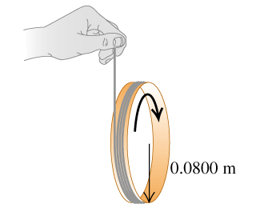

### 1003 Rigid-Body Rotation About a Moving Axis

#### Exercises
(10.19) It is well known that for a hollow, cylindrical shell rolling without slipping on a horizontal surface, half of the total kinetic energy is translational and half is rotational. What fraction of the total kinetic energy is rotational for the following objects rolling without slipping on a horizontal surface?
a. A uniform solid cylinder.
b. A uniform sphere.
c. A thin-walled hollow sphere.
d. A hollow, cylinder with outer radius R and inner radius R/2.
>Solution
Todo
Apply $K = K_{translational} + K_{rotational}$
a. The moment of inertia $I = \frac{1}{2}mR^2$.
$1/3$
b. $2/7$
c. $2/5$
c. $5/13$

(10.20) A string is wrapped several times around the rim of a small hoop with radius 8.00 cm and mass 0.180 kg . The free end of the string is held in place and the hoop is released from rest (the figure (Figure 1)). After the hoop has descended 95.0 cm, calculate the angular speed of the rotating hoop and the speed of its center.

>Solution
$\omega = 38.1, v=3.05m/s$

(10.22) A hollow, spherical shell with mass 2.45 kg rolls without slipping down a slope angled at $31.0 \degree$.
a. Find the acceleration.
b. Find the friction force.
c. Find the minimum coefficient of friction needed to prevent slipping.
>Solution
a. $a=3.03m/s^2$
b. $F_s=4.95N$
c. $\mu_s = 0.240$

(10.24) A uniform marble rolls down a symmetric bowl, starting from rest at the top of the left side. The top of each side is a distance h above the bottom of the bowl. The left half of the bowl is rough enough to cause the marble to roll without slipping, but the right half has no friction because it is coated with oil.
a. How far up the smooth side will the marble go, measured vertically from the bottom?
b. How high would the marble go if both sides were as rough as the left side?
>Solution
a. $h' = \frac{5}{7}h$
b. $h'' = h$
