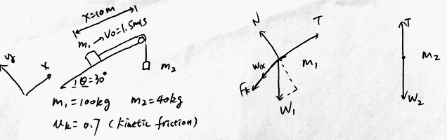

$m_1 = 100.0 kg,m_2=40.0kg$ and $\th = 30\degree$. The coefficient of kinetic friction between the block of mass $m_1$ and the incline is $\mu_k = 0.70$. The initial velocity of $m_1$ is $1.5m/s$. At what distance will $m_1$ stop?
($m_1=100kg$)

>Solution
According to Newton's Second Law,
$$
\begin{aligned}
\sum F_x &= m_1 a = T-W_{1x}-F_k\\
\sum F_y &= 0 = N - W_{1y} \\
F_k &= N \cdot \mu_k\\
W_{1x} &= W\cdot \sin \th\\
W_{1y} &= W\cdot \cos \th\\
\sum F_{2y} &= m_2 a = T - m_2 g
\end{aligned}
$$
Solve for $a$, $a = \dfrac{m_2 g - u_k m_1 g \cos\th - m_1 g \sin \th}{m_1+m_2}\approx -4.94m/s^2$.
According to Kinematic Equations,
$$
\begin{aligned}
v_f^2 &= v_0^2 + 2ax \\
\To x &= -\frac{v_0^2}{2a}\\
&= -\frac{1.5^2}{2 \times (-4.94)} \approx 0.227m
\end{aligned}
$$
