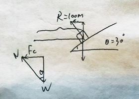

$$
F_c = \frac{mv^2}{R}
$$

1\. A car is moving along an inclined _frictionless_ circular track. The inclined angle with the horizontal line is $\th = 30\degree$, and the radius of the track is $100$m. Find the velocity $v$, so that the car does not move up or down.

>Solution
$$
\begin{aligned}
\tan \th &= \frac{F_c}{W}\\
\tan 30\degree &= \frac{\frac{mv^2}{R}}{mg}\\
\To v &= \sqrt {gR\tan 30\degree}\\
&= \sqrt {9.8 \times 100 \times \frac{1}{2}} \approx 23.8m/s
\end{aligned}
$$

2\. A car is at the bottom of a circular track with radius of $10$m, and moves along the track.
a. Find the initial velocity $v_0$, so that it just makes over the top.

>Solution
At the top of the track, the centripetal force is provided solely by the car's weight and the normal force is zero. Let the centripetal force be $F_c$, the weight of the car be $w$, and the normal be $F_N$.
1\. According to Newton's Second Law
$$
\begin{aligned}
F_c &= \frac{mv_f^2}{R} = w + F_N\\
w &= mg\\
F_N &= 0\\
\To v_f &= \sqrt {gR}
\end{aligned}
$$
2\. By Conservation of Energy
$$
\begin{aligned}
\frac{1}{2}mv_0^2 &= \frac{1}{2}mv_f^2 + mg\cdot 2R\\
\frac{1}{2}mv_0^2 &= \frac{1}{2}m \cdot (\sqrt{gR})^2 + mg\cdot 2R\\
\To v_0 &= \sqrt {5gR} \approx 22.14m/s
\end{aligned}
$$

b. At what height above ground does car leave track, if $v_0$ is 20% less than the initial velocity from part (a).

>Solution
In this case, $v_0 = 0.8\sqrt {gR}$.
Whent the car leaves the track, the normal force is zero.
$$
\begin{aligned}
F_c &= \frac{mv_f^2}{R} = w\cos \th + F_N\\
w &= mg\\
F_N &= 0\\
\To v_f &= \sqrt {gR \cos \th}
\end{aligned}
$$
2\. By Conservation of Energy, the height of the car is $y_f = R(1+\cos \th)$
$$
\begin{aligned}
\frac{1}{2}mv_0^2 &= \frac{1}{2}mv_f^2 + mg\cdot y_f\\
\frac{1}{2}m(0.8\sqrt{gR})^2 &= \frac{1}{2}m \cdot (\sqrt{gR \cos \th})^2 + mgR(1+\cos \th)\\
\To \cos \th &= 0.4\\
y_f &= R(1+\cos \th) &\\
&= 10\cdot (1+0.4) = 14m
\end{aligned}
$$
The height of the car is $14$m.
