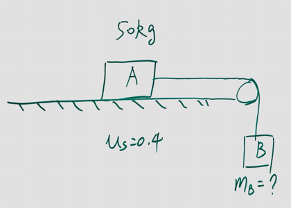

(Mid Term 2) Block A, with a mass of 50kg, rests on a horizontal table top. The coefficient of static friction is 0.40. A horizontal string is attached to A and passed over a masseless, frictionless pulley as shown. The smallest mass $m_b$ of block B, attached to the danging end, that will start A moving when it is attached to the other end of the string is:

>Solution
Todo
20kg

(Mid Term 2) A 40-N crate rest on a rough horizontal floor. A 12-N horizontal force is ten applied to it. If the coefficient of the friction are $\mu_s = 0.5$ and $\mu_k = 0.4$, the magnitude of the friction force on the crate is:
>Solution
Todo
12N

(Mid Term 2) A block is placed on a rough wooden plane. It is found when the plane it tilted $30\degree$ to the horizontal, the block will slide down at constant speed. The coefficient of kinetic friction of the block with the plane is:
>Solution
Todo
0.577 ($\tan 30\degree$)
