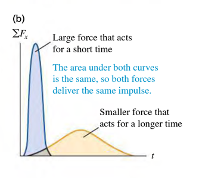

### The Impulse-Momentum Theorem
p239

The **impulse** of a net force, denoted by $\vec J$, is defined to be the product of the _net force_ and the _time interval_.
$$
\begin{aligned}
\vec J &= \sum \vec F(t_2-t_1) = \sum \vec F \Delta t &\text{(Eq.1)}
\end{aligned}
$$
1. $\vec F$ is the constant net force.
2. $t_2-t_1$ is the time interval over which the net force acts.
3. **Impulse** is a vector quantity and has the same direction as the net force $\sum \vec F$.

If the net force $\sum \vec F$ is constant, then $\frac{d\vec p}{dt}$ is also constant. In that case, $\frac{d\vec p}{dt}$ is equal to the total change in momentum $\vec p_1 - \vec p_2$ during the time interval $t_2-t_1$.
$$
\begin{aligned}
\sum \vec F &= \frac{\vec p_1 - \vec p_2}{t_2-t_1}\\
\sum \vec F (t_2-t_1)&= \vec p_1 - \vec p_2 &\text{multiplying }t_2 -t_1\\
\vec J &= \vec p_1 - \vec p_2 = \Delta p &\text{(Eq.2)}
\end{aligned}
$$
The **Impulse-Momentum Theorem**: The **impulse** of the net force on a particle during a time interval equals to the **change in momentum** of that particle during that interval.
It also holds when forces are not constant. To see this, we integrate both sides of Newton's second law $\sum \vec F = \frac{d\vec p}{dt}$ over time between $t_1$ and $t_2$
$$
\begin{aligned}
\int_{t_1}^{t_2} \sum \vec F dt = \int_{t_1}^{t_2} \frac{d\vec p}{dt} dt = \int_{p_1}^{p_2} d\vec p = \vec p_2 - \vec p_1
\end{aligned}
$$
We see from Eq.2 that integral on the left is the impulse of the net force:
$$
\begin{aligned}
\vec J = \int_{t_1}^{t_2} \sum \vec F dt
\end{aligned}
$$

The meaning of the area under a graph of $\sum F_x$ versus $t$.
 

### Exercises
8.11 At time $t = 0$ a $2150 kg$ rocket in outer space fires an engine that exerts an increasing force on it in the $+x$ direction. This force obeys the equation $F_x = At^2$, where $t$ is time, and has a magnitude of $781.25 N$ when $t = 1.25 s$.
a. Find the SI value of the constant $A$, including its units.
>Solution
$$
\begin{aligned}
F_x &= A t^2 \\
A &= \frac{F_x}{t^2} = \frac{781.25}{1.25^2} = 500N/s^2
\end{aligned}
$$

b. What impulse does the engine exert on the rocket during the $1.50 s$ interval starting $2.00 s$ after the engine is fired?
>Solution
$$
\begin{aligned}
J &= \int_{2.00}^{2.00 + 1.5} F_x dt\\
&= \int_{2.00}^{3.5} 500t^2 dt\\
&= \frac{500}{3} t^3 \mid_{2.00}^{3.5} = 5812.5 N\cdot s
\end{aligned}
$$

c. By how much does the rocket's velocity change during this interval? Assume constant mass.
>Solution
The change of momentum $\Delta p$ is $J = 5812.5N\cdot s$.
$$
\begin{aligned}
\Delta p &= m \cdot \Delta v \\
\To \Delta v &= \frac{\Delta p}{m} = \frac{5812.5}{2150} \approx 2.7 m/s
\end{aligned}
$$
