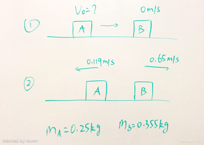

### Inelastic Collision
+ **Inelastic**
Bodies collide, bounce off, eath other move off with seperate velocities.
_Ex_: car collison and unstuck
+ **Perfectly Inelastic**
Bodies collide and stick together, and have the same final velocity.
*Ex*: asteroid hitting earch, bug hitting car windshield

In both case, only **momentum** is conserved, the **kinetic energy** is not conserved.

$$
\begin{aligned}
\vec P_i &= \vec P_f\\
m_1v_{1i} + m_2v_{2i} &= m_1v_{1f} + m_2v_{2f}\\
KE_1 &= \frac{1}{2}(m_1v_{1i}^2+m_2v_{2i}^2)\\
KE_2 &= \frac{1}{2}(m_1v_{1f}^2+m_2v_{2f}^2)\\
\Delta KE &= KE_2 - KE_1 \ne 0
\end{aligned}
$$

#### Exercises
8.21 On a frictionless, horizontal air table, puck A (with mass $0.250 kg$) is moving toward puck B (with mass $0.355 kg$), that is initially at rest. After the collision, puck A has a velocity of $0.119 m/s$ to the left, and puck B has velocity $0.650 m/s$ to the right.
(a) What was the speed of puck A before the collision?

>Solution
**Identify**: Apply _conservation of momentum_ to the system of the two pucks.
**Set up**: Let $+x$ be to the right.
**Execute**:
$$
\begin{aligned}
P_i &= P_f\\
m_a v_{ai} &= m_a v_{af} + m_b v_{bf}\\
m_a &= 0.25kg, v_{af} = -0.119 m/s, m_b = 0.355kg, v_{bf} = 0.650 m/s\\
v_{ai} &= \frac{m_a v_{af} + m_b v_{bf}}{m_a}\\
&= \frac{-0.119 \times 0.25 + 0.355\times 0.650}{0.25}\\
&= 0.804m/s
\end{aligned}
$$

(b) Calculate the change in the total kinetic energy of the system that occurs during the collision.
>Solution
$$
\begin{aligned}
K_1 &= \frac{1}{2}(m_a v_{ai}^2 + m_b v_{bi}^2)\\
&= \frac{1}{2}(0.250 \times 0.804^2 + 0)\\
&= 8.08 \times 10^{-2} J\\
K_2 &= \frac{1}{2}(m_a v_{af}^2 + m_b v_{bf}^2)\\
&= \frac{1}{2}(0.250 \times (-0.119)^2 + 0.355 \times 0.650^2)\\
&= 7.68 \times 10^{-2} J\\
\Delta K &= K_2 - K_1 = -4.04 \times 10^{-3} J
\end{aligned}
$$
