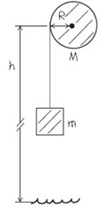
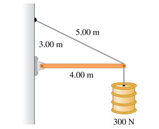
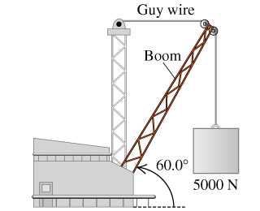

### Moment of Inertia
p290

#### Exercises
(10.9) The flywheel of an engine has moment of inertia _$1.30 kg \cdot m^2$_ about its rotation axis. What constant torque is required to bring it up to an angular speed of _400 rev/min_ in _8.00 s_, starting from rest?
>Solution
$6.81N\cdot m$

(10.10) A cord is wrapped around the rim of a solid uniform wheel 0.250 m in radius and of mass 9.20 kg. A steady horizontal pull of 38.0 N to the right is exerted on the cord, pulling it off tangentially from the wheel. The wheel is mounted on frictionless bearings on a horizontal axle through its center.
a. Compute the angular acceleration of the wheel.
b. Compute the acceleration of the part of the cord that has already been pulled off the wheel.
c. Find the magnitude of the force that the axle exerts on the wheel.
d. Find the direction of the force that the axle exerts on the wheel.
>Solution
Todo
a. $\alpha = 33.0 rad/s^2$
b. $a = 8.26/s^2$
c. $97.8N$
d. $67.1\degree$

(10.12) A stone is suspended from the free end of a wire that is wrapped around the outer rim of a pulley, similar to what is shown in (Figure 1). The pulley is a uniform disk with mass 13.0 kg and radius 27.0 cm and turns on frictionless bearings. You measure that the stone travels a distance 12.1 m during a time interval of 3.50 s starting from rest.

a. Find the mass of the stone.
b. Find the tension in the wire.
>Solution
Todo
a. $1.64kg$
b. $12.8N$

(10.15) A wheel rotates without friction about a stationary horizontal axis at the center of the wheel. A constant tangential force equal to 72.0 N is applied to the rim of the wheel. The wheel has radius 0.150 m. Starting from rest, the wheel has an angular speed of 13.3 rev/s after 2.11 s.
a. What is the moment of inertia of the wheel?
>Solution
a. $I = 0.273kg\cdot m^2$

(10.19) It is well known that for a hollow, cylindrical shell rolling without slipping on a horizontal surface, half of the total kinetic energy is translational and half is rotational. What fraction of the total kinetic energy is rotational for the following objects rolling without slipping on a horizontal surface?
a. A uniform solid cylinder.
b. A uniform sphere.
c. A thin-walled hollow sphere.
d. A hollow, cylinder with outer radius R and inner radius R/2.
>Solution
Todo
Apply $K = K_{translational} + K_{rotational}$
a. The moment of inertia $I = \frac{1}{2}mR^2$.
$1/3$
b. $2/7$
c. $2/5$
c. $5/13$

(10.20) A string is wrapped several times around the rim of a small hoop with radius 8.00 cm and mass 0.180 kg . The free end of the string is held in place and the hoop is released from rest (the figure (Figure 1)). After the hoop has descended 95.0 cm, calculate the angular speed of the rotating hoop and the speed of its center.
>Solution
$\omega = 38.1, v=3.05m/s$

(10.22) A hollow, spherical shell with mass 2.45 kg rolls without slipping down a slope angled at $31.0 \degree$.
a. Find the acceleration.
b. Find the friction force.
c. Find the minimum coefficient of friction needed to prevent slipping.
>Solution
a. $a=3.03m/s^2$
b. $F_s=4.95N$
c. $\mu_s = 0.240$

(10.24) A uniform marble rolls down a symmetric bowl, starting from rest at the top of the left side. The top of each side is a distance h above the bottom of the bowl. The left half of the bowl is rough enough to cause the marble to roll without slipping, but the right half has no friction because it is coated with oil.
a. How far up the smooth side will the marble go, measured vertically from the bottom?
b. How high would the marble go if both sides were as rough as the left side?
>Solution
a. $h' = \frac{5}{7}h$
b. $h'' = h$

(11.14) The horizontal beam in (Figure 1) weighs 190 N, and its center of gravity is at its center.

a. Find the tension in the cable.
b. Find the horizontal component of the force exerted on the beam at the wall.
c. Find the vertical component of the force exerted on the beam at the wall.
>Solution
a. $T = 658N$
b. $N_H = 527N$
c. $N_V = 95N$

(11.15) The boom in the figure below (Figure 1) weighs 2150 N and is attached to a frictionless pivot at its lower end. It is not uniform; the distance of its center of gravity from the pivot is 35 % of its length.

a. Find the tension in the guy wire.
b. Find the horizontal component of the force exerted on the boom at its lower end.
c. Find the vertical component of the force exerted on the boom at its lower end.
>Solution
a. $T = 3320N$
b. $F_H = 3320N$
c. $F_V = 7150N$
