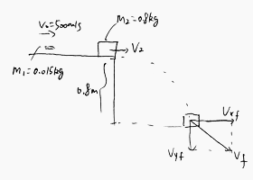

### Newton's Second Law in Terms of Momentum
Consider a particle of constant mass $m$. Because $\vec a = \dfrac{d\vec v}{dt}$,
$$
\begin{aligned}
\sum \vec F = m \cdot \frac{d\vec v}{dt} = \frac{d}{dt}(m\vec v)
\end{aligned}
$$
The net force $\sum \vec F$ acting on a particle equals the time rate of change of the product of the particle's mass and velocity. This product is called **momentum**, of the particle:
$$
\begin{aligned}
\vec p &= m\vec v\\
\sum \vec F &= \frac{d\vec p}{dt}
\end{aligned}
$$

### Exercises
(8.14) Starting $t=0s$, a horizontal net force $\vec F = (0.275 N/s) \hat i + (-0.460N/s^2)t^2 \hat j$ is applied to a bos that has an initial momentum $p=(-3.10kg \cdot m/s)\hat i + (3.85kg \cdot m/s)\hat j$. What is the momentum of the box at $t = 2.15 s$?
>Solution
$p_x,p_y = -2.46, 2.33 kg \cdot m/s$

(8.16) A $64.5 kg$ astronaut is doing a repair in space on the orbiting space station. She throws a $2.35 kg$ tool away from her at $3.50 m/s$ relative to the space station. Find the speed and direction she begin to move.
>Solution
**Identify**: Conservation of Momentum
**Setup**: Let the mass of the astronaut be $m_1$, and the mass of the tool be $m_2$. Without external force, the total momentum is zero before and after she throws the tool. Let the direction of motion of the astronaut be positive. $v_2=-3.5m/s$
$$
\begin{aligned}
0 &= m_1 v_1 + m_2 v_2\\
\To & v_1 = -\frac{m_2 v_2}{m_1}\\
&= -\frac{2.35 \times (-3.5)}{64.5} \approx 0.128m/s
\end{aligned}
$$
She will move **opposite** to the direction in which she throws the tool.

(8.17) The expanding gases that leave the muzzle of a rifle also contribute to the recoil. A $.30$-caliber bullet has mass $0.00720 kg$ and a speed of $601 m/s$ relative to the muzzle when fired from a rifle that has mass $2.80 kg$. The loosely held rifle recoils at a speed of $1.85 m/s$ relative to the earth. Find the momentum of the propellant gases in a coordinate system attached to the earth as they leave the muzzle of the rifle.
>Solution
**Identify**: The rifle, the bullet and the propellant gases are initially at rest, so the total momentum is zero. After the short is fired, the rifle, the bullet and the propellant all gain momentum.
**Set up**: Let $+x$ direction be the bullet's direction.
$$
\begin{aligned}
p_1 &= 0 = p_2 = p_r + p_b + p_g\\
p_r &= m_r v_r = 2.80 \times (-1.85)\\
p_b &= m_b v_b = 0.0072 \times 601\\
p_g &= -p_r - p_b = 0.8528 N/s
\end{aligned}
$$

(8.27) Two ice skaters, Daniel (mass $65.0 kg$) and Rebecca (mass $45.0 kg$), are practicing. Daniel stops to tie his shoelace and, while at rest, is struck by Rebecca, who is moving at $13.0 m/s$ before she collides with him. After the collision, Rebecca has a velocity of magnitude $8.00 m/s$ at an angle of $53.1 \degree$ from her initial direction. Both skaters move on the frictionless, horizontal surface of the rink.
(a) What are the magnitude and direction of Daniel's velocity after the collision?
(b) What is the change in total kinetic energy of the two skaters as a result of the collision?

(8.35) In July 2005, NASA's "Deep Impact" mission crashed a $372 kg$ probe directly onto the surface of the comet Tempel 1, hitting the surface at $37000 km/h$ relative to the surface. The original speed of the comet at that time was about $40000 km/h$, and its mass was estimated to be in the range $(0.10-2.5) \times 10^{14}kg$. Use the smallest value of the estimated mass.
(a) What change in the comet's velocity did this collision produce?
>Solution
$|\Delta v| = 1.4 \times 10^{-6} km/h$

(b) Suppose this comet were to hit the earth at $40000 km/h$ and fuse with it. By how much would it change our planet's velocity? (The mass of the earth is $5.97 \times 10^{24} kg$.)
>Solution
$|\Delta v| = 6.7\times 10^{-8} km/h$
Todo

(Quiz0314) A bullet $m_1 = 15g$ with intial velocity of $500m/s$ hits a wood block $m_2 = 0.8kg$ at the edge of a table with height of $0.8m$ and stays inside the block after collision. Find the final velocity of the wood block before it hits the ground.

>Solution
Stage 1, after the bullet hits the block and before the block start to fall. By conservation of momentum
$$
\begin{aligned}
m_1v_0 &= (m_1 + m_2) v_2\\
v_2 &= \frac{m_1v_0}{m_1+ m_2} \\
&= \frac{0.015 \cdot 500}{0.815} = 9.2m/s
\end{aligned}
$$
Stage 2, from the edge of the table to the ground. Accoring to Kinematic Equations
$$
\begin{aligned}
v_{yf}^2 &= v_{y0}^2 + 2ay\\
v_{yf} &= \sqrt {v_{y0}^2 + 2ay} \\
&= \sqrt{0 + 2\cdot 9.8\cdot 0.8 } = 3.96m^2\\
v_f & = \sqrt{v_{xf}^2 + v_{yf}^2}\\
&= \sqrt{9.2^2 + 3.96^2} = 10m/s
\end{aligned}
$$
