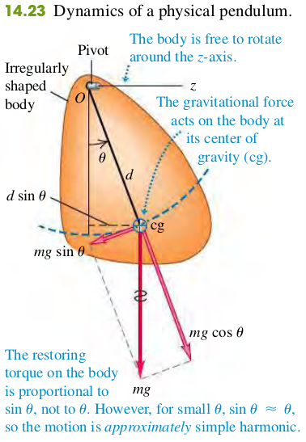
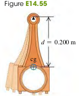

### The Physical Pendulum
A **Physical Pendulum** is any real pendulum that uses an extended body, as contrasted to the idealized simple pendulum with all of its mass concentrated at a point.

**Figure 14.23** shows a body of irregular shape pivoted so that it can turn without friction about an axis through point $O$. When the body is displaced as shown, the weight mg causes a restoring torque
$$
\begin{aligned}
\tau = -(mg) (d\sin \th) \quad &\text{(1)}
\end{aligned}
$$
When the body is releases, it oscillates about its equilibrium position. The motion is not SHM becaues the torque $\tau$ is proportional to $\sin \th$ rather than to $\th$. However, if $\th$ is small, we can approximate $\sin \th$ by $\th$ in radians. Then the motion is _approximately_ SHM.
$$
\begin{aligned}
\tau &= -mgd(\th) \quad &\text{(2)}
\end{aligned}
$$
The torque and angular acceleration have the relation that $\sum \tau = I \alpha$,
$$
\begin{gathered}
\tau = -mgd(\th) = I \alpha = I \frac{d^2 \th}{d t^2}\\
\frac{d^2 \th}{d t^2} = -\frac{mgd}{I}\th \quad &\text{(3)}
\end{gathered}
$$
Comparing equation (3) with $a = \dfrac{d^2 x}{dt^2}= -\dfrac{k}{m}x$ for the spring-mass system, the quantity ($mgd/I$) and $\frac{k}{m}$ play the same role. Thus the angular frequency is
$$
\begin{aligned}
\omega &= \sqrt{\frac{mgd}{I}} \quad &\text{(4)}
\end{aligned}
$$
where $m$ is the mass of the object, $d$ is the distance from the center of mass to the pivot point and $I$ is the moment of inertia. (can be obtained by parallel axis-theorem)
The period $T$ is
$$
\begin{aligned}
T &= \frac{2\pi}{\omega} = 2\pi \sqrt{\frac{I}{mgd}} \quad &\text{(5)}
\end{aligned}
$$

#### Exercises
(Example 14.9) If the body in Fig 14.23 is a uniform rod with length L, pivoted at one end, what is the period of its motion as a pendulum?
>Solution
According to the parallel axis theorem, the moment of inertia of a uniform rod about an axis through one end is
$$
\begin{aligned}
I =\frac{1}{12}mL^2 + m(\frac{L}{2})^2 = \frac{1}{3} mL^2
\end{aligned}
$$
Let the length $L=1.00m$, the period $T$ is
$$
\begin{aligned}
T &= 2\pi \sqrt{\frac{I}{mgd}} = 2\pi \sqrt{\frac{\frac{1}{3} mL^2}{mgL/2}} = 2\pi \sqrt{\frac{2L}{3g}}\\
&= 2\pi \sqrt{\frac{2 \cdot 1}{3 \cdot 9.8}} = 1.64s
\end{aligned}
$$

(14.53) Two pendulums have the same dimensions (length L) and total mass (m). Pendulum A is a very small ball swinging at the end of a uniform massless bar. In pendulum B, half the mass is in the ball and half is in the uniform bar.
a. Find the period of pendulum A for small oscillations.
b. Find the period of pendulum B for small oscillations.
>Solution
a. The moment of inertia of the ball is $I = mL^2$. The period $T_A$ is
$$
\begin{aligned}
T_A = 2\pi \sqrt{\frac{I}{mgd}} = 2\pi \sqrt{\frac{mL^2}{mgL}} = 2\pi \sqrt{\frac{L}{g}}
\end{aligned}
$$
b. For pendulum B the distance d from the axis to the center of gravity is $3L/4$. $I_{bar}=\dfrac{1}{3} \cdot \dfrac{m}{2}L^2$ for a bar of mass $\dfrac{m}{2}$ and the axis at one end. For a small ball of mass $\dfrac{m}{2}$ at a distance L from the axis, $I_{ball}=\dfrac{m}{2} L^2$. The distance $d = \frac{3}{4}L$
$$
\begin{aligned}
T_B &= 2\pi \sqrt{\frac{I}{mgd}}\\
&= 2\pi \sqrt{\frac{\frac{1}{3} \cdot \frac{m}{2}L^2 + \frac{m}{2} L^2 }{md \cdot \frac{3}{4}L}}\\
&=  2\pi \sqrt{\frac{8L}{9g}}
\end{aligned}
$$

(14.54) We want to support a thin hoop by a horizontal nail and have the hoop make one complete small-angle oscillation each 2.0 s.
>Solution
The period $T$ is
$$
\begin{aligned}
T &= 2\pi \sqrt{\frac{I}{mgd}} &\text{(1)}
\end{aligned}
$$
The moment of inertia of the thin hoop about the axis through one end is
$$
\begin{aligned}
I &= mR^2 + mR^2 = 2mR^2 &\text{(2)}
\end{aligned}
$$
The distance $d$ from the center of mass to the pivot point is $d = R$.
Combining (1) and (2), we have
$$
\begin{aligned}
T &= 2\pi \sqrt{\frac{2mR^2}{mgR}} = 2\pi \sqrt{\frac{2R}{g}}\\
\To R &= (\frac{T}{2\pi})^2 \cdot \frac{g}{2} = 0.496m
\end{aligned}
$$

(14.55) A 1.80-kg connecting rod from a car engine is pivoted about a horizontal knife edge as shown in Fig. E14.55. The center of gravity of the rod was located by balancing and is 0.200 m from the pivot. When the rod is set into small-amplitude oscillation, it makes 100 complete swings in 120 s. Calculate the moment of inertia of the rod about the rotation axis through the pivot.

(14.64)

(14.66)

(14.68)
