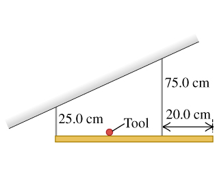

### Torque
p303

#### Exercises
(11.6) Two people are carrying a uniform wooden board that is 3.00 m long and weighs 160 N. If one person applies an upward force equal to 60 N at one end, at what point does the other person lift? Begin with a free-body diagram of the board.

>Solution
x = 2.4m

(11.8) A 50.0-cm, uniform, 50.0-N shelf is supported horizontally by two vertical wires attached to the sloping ceiling (the figure (Figure 1)). A very small 17.0-N tool is placed on the shelf midway between the points where the wires are attached to it.
a. Find the tension in left wire.
b. Find the tension in righ wire.

>Solution
a. $T_L = 16.8N$
b. $T_R = 50.2N$

(11.10) A uniform ladder 5.0 m long rests against a frictionless, vertical wall with its lower end 3.0 m from the wall. The ladder weighs 160 N. The coefficient of static friction between the foot of the ladder and the ground is 0.40. A man weighing 740 N climbs slowly up the ladder.
a. What is the maximum frictional force that the ground can exert on the ladder at its lower end?
b. What is the actual frictional force when the man has climbed 1.0 m along the ladder?
c. How far along the ladder can the man climb before the ladder starts to slip?

>Solution
a. $F_s = 360N$
b. $F_s = 171N$
c. $s = 2.7m$

(11.12) A uniform, aluminum beam 9.00 m long, weighting 300 N, rests symmetrically on two supports 5.00 m apart. A boy weighing 600 N starts at point A and walks toward the right.
a. How far beyond point B can the boy walk before the beam tips?
b. How far from the right end of the beam should support B be placed so that the boy can walk just to the end of the beam without causing it to tip?

>Solution
a. $1.25m$
b. $1.5m$
