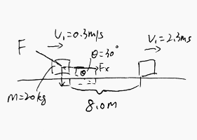

### Work
p173

#### Exercises
(Quiz0314) A constant external force $F=130N$ is applied to a $20kg$ box, which is on a rough horizontal surface. The force push the box a distance of $8.0m$ in a time interval of $7.0s$ and the speed changed from $v_1=0.3m/s$ to $v_2=2.3m/s$. Find the work done by the friction.

>Solution
1\. The work done by $F_x$ is
$$
\begin{aligned}
W_{Fx} &= F_x \cdot x = x \cdot F\cos \th \\
&= 8.0 \cdot 130 \cdot \cos 30 \degree\\
&\approx 900.67 J
\end{aligned}
$$
2\. By conservation of energy, _initial kinetic energy + work from external force = final kinetic energy + energy loss (caused by friction)_
$$
\begin{aligned}
\frac{1}{2}mv_1^2 + W_{Fx} &= \frac{1}{2}mv_2^2 + E_{loss}\\
E_{loss} &= \frac{1}{2}mv_1^2 + W_{Fx} - \frac{1}{2}mv_2^2\\
&= \frac{1}{2} \cdot 20 (0.3^2-2.3^2) + 900.67\\
&=848.67J
\end{aligned}
$$
Since friction force is against the moving direction, the work down by firctin is $-848.67J$.
