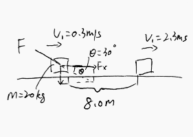

### Work
p173

#### Exercises
(Quiz0314) A constant external force $F=130N$ is applied to a $20kg$ box, which is on a rough horizontal surface. The force push the box a distance of $8.0m$ in a time interval of $7.0s$ and the speed changed from $v_1=0.3m/s$ to $v_2=2.3m/s$. Find the work done by the friction.

>Solution
1\. The work done by $F_x$ is
$$
\begin{aligned}
W_{Fx} &= F_x \cdot x = x \cdot F\cos \th \\
&= 8.0 \cdot 130 \cdot \cos 30 \degree\\
&\approx 900.67 J
\end{aligned}
$$
2\. By conservation of energy, _initial kinetic energy + work from external force = final kinetic energy + energy loss (caused by friction)_
$$
\begin{aligned}
\frac{1}{2}mv_1^2 + W_{Fx} &= \frac{1}{2}mv_2^2 + E_{loss}\\
E_{loss} &= \frac{1}{2}mv_1^2 + W_{Fx} - \frac{1}{2}mv_2^2\\
&= \frac{1}{2} \cdot 20 (0.3^2-2.3^2) + 900.67\\
&=848.67J
\end{aligned}
$$
Since friction force is against the moving direction, the work down by firctin is $-848.67J$.

(Mid Term 2) A 2.5kg sliding on a rough surface, has a speed of 1.2m/s when it makes contact with a spring. The block comes to a momentary halt when the compression of the spring is 5.0cm. The work done by the friction, from the instant the block makes contact with the soring until it comes to a momentary halt is -0.50J. Find the force constant of the spring.

>Solution
By Conservation of Energy, _initial kinetic energy = elastic potential energy (spring) + energy loss (caused by friction)_
Let the force constant of the spring be $k$
$$
\begin{aligned}
\frac{1}{2}mv_0^2 &= \frac{1}{2}kx^2 + E_{loss}\\
\To k&=\frac{mv_0^2 + 2E_{loss}}{x^2}\\
&= \frac{2.5\cdot 1.2^2 + 2 \cdot 0.5}{0.05^2} = 1040N/m
\end{aligned}
$$

(Mid Term 2) A mass is projected up an inclined plane with friction coefficient of $\mu_k=0.5$ with an initial velocity $v_0 = 5m/s$.
a. Calculate the maximum height the mass moves up the plane.
b. Find the final velocity whtn the mass reaches the starting point (assume it does not stick at the top).

>Solution
a. By Newton's Second Law, we have
$$
\begin{aligned}
\sum F_x &= ma \\
&= F_k + mg\sin\th\\
F_k &= F_N\cdot \mu_k &\text{Kinetic Friction}\\
&= \mu_k mg\cos\th\\
\To a &= (\mu_k \cos \th + \sin \th) g\\
&= (0.5\cos 30\degree + \sin 30\degree)g = 9.14m/s^2
\end{aligned}
$$
According to Kinematic Equation, we have
$$
\begin{aligned}
v_f^2 &= v_0^2 + 2ax \quad v_f = 0m/s, a = 9.14m/s^2\\
x&= -\frac{v_0^2}{2a}\\
&= -\frac{5^2}{2 \cdot 9.14} \approx -1.37m
\end{aligned}
$$
The maxium height is 1.37m.
b. The energy loss is caused by friction from bottom to top and then from top back to bottom. The work done by the friction are the same, since the friction force and distance are the same.
Let the enrgy loss be $E_{loss}$
(1) From bottom to the top, $\dfrac{1}{2}mv_0^2 = mgh + E_{loss}$
(2) From top back to bottom, $mgh= \dfrac{1}{2}mv_f^2 + E_{loss}$
(3) The energy loss due to friction $E_{loss} = F_k x = \mu_k mg\cos \th$
Combining (1), (2) and (3), we have
$$
\begin{aligned}
\frac{1}{2}mv_0^2 &= \frac{1}{2}mv_f^2 + 2E_{loss}\\
\To v_f &= \sqrt{v_0^2 - 4\mu_kxg\cos\th}\\
&= \sqrt{5^2 - 4 \cdot 0.5 \cdot 1.37 \cdot 9.8 \cos 30\degree} \approx 1.32m/s
\end{aligned}
$$
